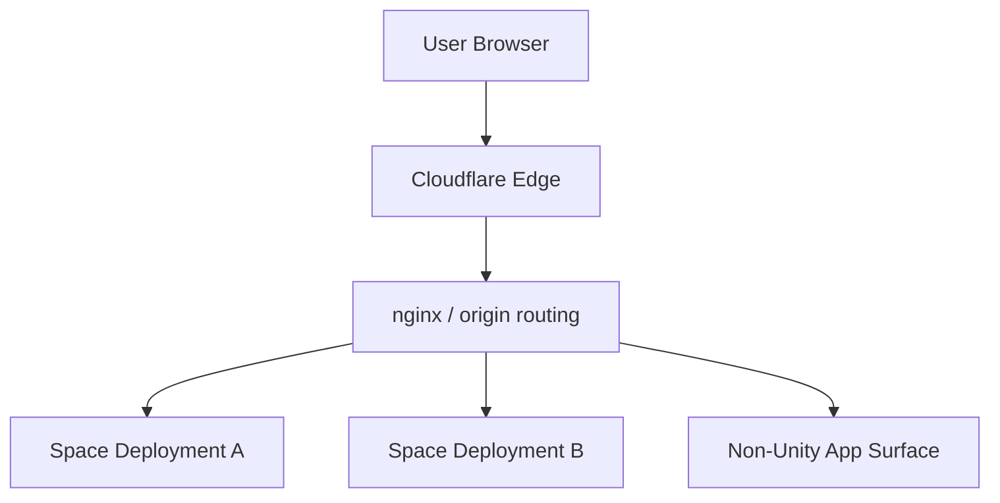
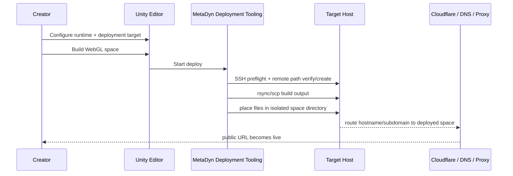

# Deployment and Hosting

## Delivery Model

The imported platform docs are explicit that deployment is part of the product, not a disconnected ops concern.

The Unity platform is designed so that creators can:
- configure deployment from the Unity editor
- build WebGL output
- deploy to remote infrastructure using SSH/rsync/scp-style workflows
- embed runtime metadata into the deployed build

## Executive Framing

MetaDyn deployment should be understood as a **space delivery system** with both creator-side and infrastructure-side responsibilities.

Creator-side responsibilities:
- define runtime config
- choose the deployment target
- build and publish a space

Infrastructure-side responsibilities:
- provide origin storage/serving
- map hostnames to the right space deployment
- keep SSL, DNS, and proxying coherent
- support multiple spaces without collapsing them into one giant runtime

That split matters because MetaDyn is not trying to ship a one-off build process. It is trying to ship a repeatable deployment model for many spaces.

## Canonical Deployment Rule

**Each space is its own build.**

This rule is central to the imported deployment architecture and applies across both hosting models.

## Space Delivery Model

| Concern | Rule |
|---|---|
| Build unit | each space is its own build |
| Deployment isolation | each space should have isolated files/path boundaries |
| Runtime identity/config | embedded or attached per deployed space |
| Hosting flexibility | works in both managed/shared and self-hosted modes |
| Platform continuity | shared through SDK, identity, and platform services rather than shared build artifacts |

## Hosting Models

### Shared Hosting
MetaDyn intends to support a shared-hosting model where:
- multiple spaces can live on the same physical or virtual host
- each space still has isolated deployment files or runtime instance boundaries
- routing/proxy rules map each hostname/subdomain to the correct space deployment

### Self-Hosting
MetaDyn also intends to support self-hosted deployments where:
- customers, partners, or studios deploy to infrastructure they control
- the same core deployment model still applies
- runtime config, deployment metadata, and routing remain important
- creators can preserve long-term independence from MetaDyn-operated services when desired
- a standalone path should remain possible even if the creator later disconnects from MetaDyn-connected auth or ecosystem features

### Hosting Model Comparison

| Dimension | Shared Hosting | Self-Hosting |
|---|---|---|
| Infra ownership | MetaDyn or MetaDyn-managed host | customer / partner / studio |
| Space isolation | per-space directories and routing boundaries | still required |
| Deployment workflow | standardized managed path | same model with different target owner |
| Support burden | higher for MetaDyn | higher for customer/operator |
| Product fit | strong for managed platform offer | strong for enterprise / agency flexibility |

## Cloudflare Role

Imported infrastructure docs describe Cloudflare as the edge layer for:
- DNS
- proxying
- SSL/TLS
- CDN behavior
- cached Unity WebGL asset delivery
- WebSocket support for realtime systems

This supports the WebGL-first platform strategy by reducing latency and improving global delivery.

## Ingress Stack

| Layer | Current Role |
|---|---|
| Cloudflare | external DNS, edge SSL, proxying, cache behavior |
| nginx / origin routing | maps hostnames to space deployments or app surfaces |
| host filesystem / app instance | stores the actual deployed space build or runtime |
| Unity runtime config | carries per-space operational metadata into the experience |



## Unity WebGL Hosting Pattern

The documented per-space deployment pattern uses isolated remote directories such as:

```text
{remotePath}/{roomName}-{spaceId}/
```

This supports:
- per-space isolation
- cleaner routing management
- better rollback/version discipline
- managed hosting for multiple spaces on one server

## Deployment Flow

### High-Level Flow



## Deployment Tooling

Imported docs point to editor-integrated tooling for:
- server profile management
- deployment configuration
- remote upload via SSH/rsync/scp
- runtime config embedding
- deployment preflight checks

Documented hardening already includes:
- remote directory creation/verification before transfer
- explicit failure handling when remote paths cannot be confirmed
- more actionable deployment feedback inside Unity

## Key Deployment Files

| File | Role |
|---|---|
| `Assets/MetaDyn/Core/Editor/MetaDynSDK/MetaDynDeploymentManager.cs` | executes deployment workflow |
| `Assets/MetaDyn/Core/Editor/MetaDynSDK/MetaDynProjectConfig.cs` | creator-facing deployment/editor UI |
| `Assets/MetaDyn/Core/Editor/MetaDynSDK/MetaDynServerProfile.cs` | target host/profile config |
| `Assets/MetaDyn/Core/Runtime/MetaDynRuntimeConfig.cs` | space runtime metadata and join config |

## Operational Direction

The imported docs point toward a more mature hosting/control model over time, including:
- deployment metadata per space
- routing/proxy automation
- version tracking and rollback
- shared-hosting vs self-hosting distinction
- dashboard/backend visibility into deployment state

## Deployment Metadata Model

To support real multi-space operations, each deployment should eventually have explicit metadata.

### Core Metadata Fields

| Field | Why It Matters |
|---|---|
| `spaceId` | stable identity for the deployment target |
| `roomName` | runtime join/session identity |
| `worldDisplayName` | creator-facing/public identity |
| deployment type | distinguishes shared vs self-hosted operational path |
| target host/profile | tells ops where the space actually lives |
| target directory/path | allows auditability and rollback discipline |
| public URL | ties deployment to the user-facing route |
| owner/admin identity | ties governance to a real actor |
| deployed build version | gives change visibility |
| deployed timestamp | supports support/debugging/history |

## Environment / Provider Context

From the broader workspace infra docs, current MetaDyn deployment context includes:
- AWS stage at `16.58.195.11` (`stage.metadyn.xyz`, plus several related experience hosts)
- Hetzner prod/service cluster at `87.99.130.86` (`prod`, `crm`, `gitlab`, `analytics`, `monitor`, `aurora-01`)
- on-prem/dev hybrid edge at `136.34.121.206` (`hyperfy`, `lunara`, `pavilion`, `aurora-02`)
- Netlify for root-site/dashboard/dev web surfaces

That means deployment docs need to respect a real multi-provider topology rather than pretending everything lands on one simple host.

## Provider Role Matrix

| Provider / Edge | Current Role | Deployment Relevance |
|---|---|---|
| Cloudflare | DNS + proxy + edge delivery | front door for many public surfaces |
| AWS | current stage + several app/experience origins | likely key Unity and experience host target |
| Hetzner | prod/service apps and reverse-proxy-heavy surfaces | important for production service delivery |
| On-prem hybrid edge | Hyperfy/Pavilion/dev AI surfaces | important for immersive and experimental surfaces |
| Netlify | dashboard/site/dev frontend hosting | control-plane and marketing/front-end delivery |

## Why This Matters

This is one of the clearest platform differentiators in the imported material:

MetaDyn is not just offering a Unity world. It is building a **deployable platform workflow** where creation, packaging, and hosting are part of one continuous product experience.

## Current Strong Areas

| Area | Why It Looks Strong |
|---|---|
| Editor-driven deploy workflow | deployment is already inside creator workflow |
| SSH preflight and path verification | avoids a class of silent remote-path errors |
| Cloudflare + nginx model | practical and credible WebGL delivery architecture |
| Per-space isolated directory rule | supports a true multi-space platform model |

## Important Gaps Still Visible

The deeper documentation pass also shows that deployment maturity is uneven across layers.

What appears comparatively mature already:
- Unity editor-driven deploy workflow
- SSH preflight and remote-path verification
- Cloudflare + nginx delivery model
- per-space isolated deployment rule

What still appears to be evolving:
- versioned release directories and rollback
- host deployment API / dashboard-driven deployment execution
- authoritative deployment metadata model
- automated DNS / proxy provisioning at platform scale
- cleaner dev/staging/prod environment governance

So the deployment model is strong, but not fully productized yet as a large-scale managed platform workflow.

## Missing Operational Docs To Add Next

| Needed Doc/Section | Why |
|---|---|
| environment matrix (dev/stage/prod/on-prem) | remove ambiguity about target selection |
| routing/proxy generation model | explain how new spaces become reachable |
| rollback/version history model | required for safer managed hosting |
| shared-hosting runbook | operationalize the concept into repeatable steps |
| self-hosting handoff requirements | make external deployments more realistic |

## Recommended Next Steps

1. Define the deployment metadata schema for spaces.
2. Define how nginx/proxy configs are generated or updated per space.
3. Decide whether deployment config changes are file-templated or dashboard/API-generated.
4. Define shared-hosting provisioning flow separately for:
   - Unity WebGL spaces
   - Hyperfy spaces
5. Add deployment history / rollback metadata.
6. Define how dashboard surfaces shared-hosted vs self-hosted spaces.

## Source Basis

Primary sources reflected here:
- `import/unity6-docs/.claude/Quick Reference/INFRASTRUCTURE.md`
- `import/unity6-docs/.claude/Planning/MetaDyn_Platform_PRD_v1.0.md`
- workspace `docs/infrastructure/topology.md`
