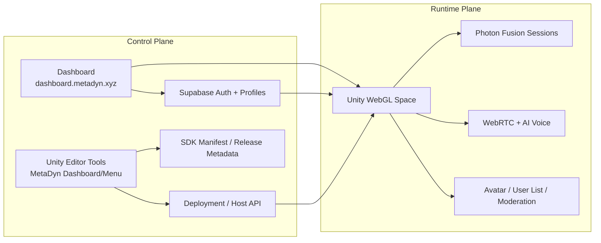
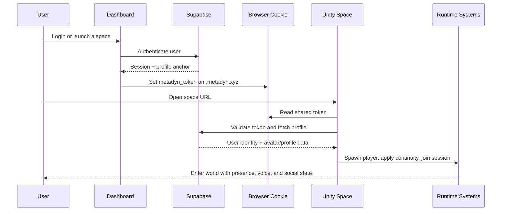

# Platform Overview

## Summary

MetaDyn is not just a Unity project and not just a hosted website. It is a multi-layer platform where the **Unity runtime**, **MetaDyn SDK**, **dashboard**, **identity system**, **deployment pipeline**, and **hosted space model** work together as one product.

The imported documentation makes that clear once the pieces are read together:
- the Unity runtime is the immersive execution layer
- the SDK is the reusable platform layer shipped into spaces
- the dashboard is the creator and identity control plane
- Supabase is the canonical identity/profile store
- deployment tooling is part of the product, not a sidecar ops concern
- hosted spaces are separate builds connected by shared platform services

That cross-system glue is the platform’s **connective tissue**.

## Product Layers

The imported PRD describes MetaDyn as three connected product layers.

### 1. MetaDyn SDK
A reusable Unity platform layer that provides runtime systems, editor tooling, deployment tooling, auth integration, and platform services.

### 2. MetaDyn Starter Space Template
A MetaDyn-owned Unity starter project/template containing the SDK plus a ready-to-build starter world.

### 3. MetaDyn Hosted Platform
The runtime and hosting layer for deployed spaces, including WebGL hosting, auth/session continuity, backend integration, and support for managed/shared hosting as well as self-hosting.

## Platform Goals

The Unity platform is designed to:
- let creators build and deploy multi-user WebGL spaces with low friction
- keep deployment as a first-class part of the SDK workflow
- support identity continuity across spaces and subdomains
- provide strong social and voice foundations
- support embodied AI as a native differentiator
- support both managed/shared hosting and self-hosted deployment models

## Core Pillars

### Unity SDK Platform Layer
The SDK is the reusable core. It should be installable into Unity projects and carry platform logic, runtime services, editor features, and deployment tooling.

### Space Deployment
Each space is its own build. Deployment is per-space, with runtime configuration and isolated hosting paths.

### Identity and Access
The platform uses web-first auth, persistent profiles, avatar persistence, owner/admin identification, and cross-space session continuity.

### Social / Multiplayer
The platform includes multiplayer sessions, moderation, synchronized presence, user lists, and voice communication.

### Embodied Experience Foundation
Even though broader AI docs will be organized separately later, the platform already expects space experiences to support avatars, voice, embodied presence, and persistent context.

## Current Positioning

The imported docs consistently position MetaDyn as:
- WebGL-first
- creator-first
- SDK-driven
- deployment-aware
- able to support both internal spaces and client/partner spaces

This makes the Unity 6 platform the main delivery layer for the broader MetaDyn metaverse vision.

## The Connective Tissue

The most important product truth is that MetaDyn is a **connected system of systems**.

A deployed space is not standalone. It depends on:
- dashboard-authenticated users
- shared platform identity
- SDK-owned runtime and editor systems
- WebGL browser bridges
- deployment metadata and host routing
- multiplayer and voice substrate
- persisted profile and avatar continuity

If those systems are documented separately but not connected conceptually, the platform looks thinner than it really is. The connective tissue is what turns “many features” into “one platform.”

### Connective Tissue Matrix

| Platform Concern | Primary Surface | Supporting Systems | Why It Matters |
|---|---|---|---|
| Creator workflow | Unity Editor + MetaDyn Dashboard window | SDK tooling, project config, deployment manager | Makes platform operations native to creator workflow |
| Runtime identity | Unity WebGL space | Dashboard login, Supabase, cookie bridge, profile fetch | Lets users move through spaces with continuity |
| Space launch | Browser + Unity bootstrap | dashboard redirects, runtime config, auth bridge | Reduces friction at world entry |
| Deployment | Unity editor tooling + host execution plane | build pipeline, config generation, DNS/proxy setup | Makes each space shippable as a productized unit |
| Social presence | Unity runtime | Photon Fusion, user list, moderation, name tags | Makes spaces feel inhabited instead of static |
| Voice interaction | Unity runtime + browser | WebRTC, mic worklet, avatar lip sync, AI voice systems | Enables embodied social and AI experiences |
| Cross-space continuity | Dashboard + profile backend | Supabase profiles, avatar persistence, identity UUID | Makes MetaDyn feel like one ecosystem |
| Hosting flexibility | Hosted space layer | Cloudflare, nginx/origin, per-space isolation | Supports both managed and self-hosted models |

## Control Plane vs Runtime Plane

A useful way to understand MetaDyn is to separate the **control plane** from the **runtime plane**.

### Control Plane
The systems used to configure, authenticate, deploy, and govern spaces.

Includes:
- dashboard.metadyn.xyz
- Supabase auth/profile systems
- editor dashboard/menu tooling
- deployment configuration and metadata
- host provisioning/deployment APIs
- release/update metadata for the SDK

### Runtime Plane
The systems users directly experience inside the live space.

Includes:
- Unity scenes and prefabs
- player spawning and avatar selection
- Photon Fusion sessions
- user list and moderation surfaces
- WebRTC player voice
- embodied AI interactions

### Why This Split Matters
The runtime plane is what users see, but the control plane is what makes the runtime coherent, repeatable, and productizable.

Without the control plane, you may still have a demo.
With it, you have a platform.

## Canonical User and Space Journey

The imported docs imply a single end-to-end product journey rather than disconnected features.

### User Journey Table

| Stage | User Sees | Platform Systems Involved | Result |
|---|---|---|---|
| Discover / launch | Dashboard or direct space URL | Dashboard, DNS/routing, hosted space URL | User lands in the MetaDyn ecosystem |
| Authenticate | Web login/signup | Dashboard, Supabase, shared cookie | User identity becomes portable |
| Enter a space | Unity WebGL bootstrap | AuthBridge.jslib, WebAuthBridge, SupabaseAuthManager | User enters with validated identity |
| Restore profile | Avatar/name continuity | Supabase profile data, avatar_index, runtime config | Returning users feel remembered |
| Join others | Multiplayer session bootstrap | Photon Fusion, GameManager, Player systems | User becomes part of the social runtime |
| Speak / interact | Voice and embodiment | WebRTC, mic processor, AI voice systems | Space becomes embodied and interactive |
| Revisit / move surfaces | Cross-space continuity | shared identity, dashboard, hosted spaces | MetaDyn feels like one platform, not isolated sites |

## Platform Capability Stack

| Layer | What It Owns | Current Reality |
|---|---|---|
| Experience Layer | scenes, interactions, UI, world logic | Real and active in current Unity spaces |
| SDK Layer | reusable runtime/editor/deployment systems | Real, substantial, but packaging is transitional |
| Identity Layer | auth, profile, avatar continuity, session bootstrap | Implemented for dashboard-to-Unity flow |
| Social Layer | session join, presence, moderation, user list | Implemented with Fusion-centered runtime patterns |
| Voice Layer | player voice + AI voice paths | Implemented but large-scale media architecture is future work |
| Hosting Layer | per-space deploys, routing, origin delivery | Real, with shared-hosting and self-hosting direction still maturing |
| Control Layer | update visibility, deployment UX, platform governance | Present in concept and partly in-editor today |

## Space Model: Separate Builds, Shared Fabric

One of the clearest architectural rules in the imported docs is:

**Each space is its own build.**

That does **not** mean each space is its own product island.

A better framing is:
- each space is independently built and deployed
- each space carries the same platform layer
- each space participates in shared identity and platform services
- each space can be managed under a common hosted/control model

### Space Independence vs Platform Cohesion

| Dimension | Independent Per Space | Shared Across Platform |
|---|---|---|
| Unity build artifacts | Yes | No |
| Runtime config | Yes | Partly standardized |
| Scene/environment content | Yes | No |
| SDK platform systems | No | Yes |
| Auth/profile model | No | Yes |
| Creator tooling model | No | Yes |
| Deployment philosophy | No | Yes |
| User identity continuity | No | Yes |

## Dashboard As Product Glue

The dashboard should not be described as merely a web portal.
It is the main product glue across the platform.

It currently anchors or is expected to anchor:
- login and signup
- profile management
- launch flows into spaces
- deployment/control-plane integration
- future creator/admin platform management
- future cross-runtime continuity work

That makes the dashboard the **front door** to the broader MetaDyn fabric, not a separate app living beside it.

## Why The SDK Matters Strategically

The SDK is the mechanism that lets the MetaDyn platform travel.

Without the SDK, the platform remains trapped inside one project.
With the SDK, MetaDyn can:
- reproduce core systems across spaces
- support starter templates
- support managed and self-hosted customer models
- distribute a stable creator workflow
- evolve platform behavior without rebuilding everything from scratch

This is why the imported docs repeatedly treat deployment tooling, browser bridges, and editor UX as part of the SDK product surface rather than invisible internals.

## Current Reality Checks

A few points are worth keeping explicit throughout this doc set:

- MetaDyn auth is already web-first for Unity, using dashboard login plus a shared `.metadyn.xyz` cookie bridge.
- Hyperfy unified login is no longer just a future aspiration; the next documentation step is profile/data continuity across surfaces, not merely raw login parity.
- Each Unity space is currently treated as its **own build**.
- Deployment tooling is considered part of the SDK/product story, not separate internal ops garnish.
- The SDK is real and substantial today, but its packaging and update story are still transitional.
- The active Starter runtime path now uses UGS/NGO as the declared networking baseline rather than Photon Fusion.
- The active social voice/text path for the migrated UGS branch is Vivox.
- Mobile browser support is now part of the practical runtime hardening track.
- The current social/voice stack is meaningful and usable, but very large-room media scale will require a later SFU path.

## Product Tensions To Manage

| Tension | Why It Exists | Documentation Position |
|---|---|---|
| Reusable SDK vs project history | Some platform files still live outside ideal package roots | Document current reality while planning cleaner boundaries |
| Web-first identity vs custom domains | Shared cookies work best on `*.metadyn.xyz` | Treat custom-domain auth handoff as a future explicit flow |
| Independent spaces vs unified platform | Spaces are separate builds | Emphasize shared platform services and continuity |
| Creator-friendliness vs enterprise rigor | Platform serves both studios and larger clients | Keep the workflow Unity-native while exposing operational clarity |
| Current implementation vs final productization | Many pieces exist before packaging is complete | Be explicit about what is real now and what remains transitional |

## Recommended Reading After This

To understand the connective tissue in more depth, read next:
1. `system-architecture.md`
2. `auth-identity.md`
3. `deployment-hosting.md`
4. `sdk-productization.md`

## Source Basis

Primary imported sources reflected here:
- `import/unity6-docs/.claude/Planning/MetaDyn_Platform_PRD_v1.0.md`
- `import/unity6-docs/.claude/Planning/Dashboard_Unity_Hyperfy_Flows.md`
- `import/unity6-docs/.claude/Quick Reference/AUTH_SYSTEM.md`
- `import/unity6-docs/.claude/Quick Reference/SDK_DEVELOPMENT.md`
- `import/unity6-docs/.claude/Quick Reference/SDK_TOOLKIT_INVENTORY.md`
- `import/unity6-docs/.claude/Quick Reference/SDK_UPDATE_MANIFEST.md`
