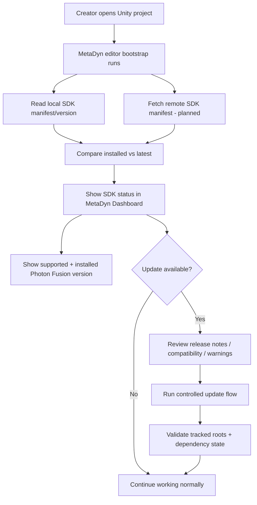
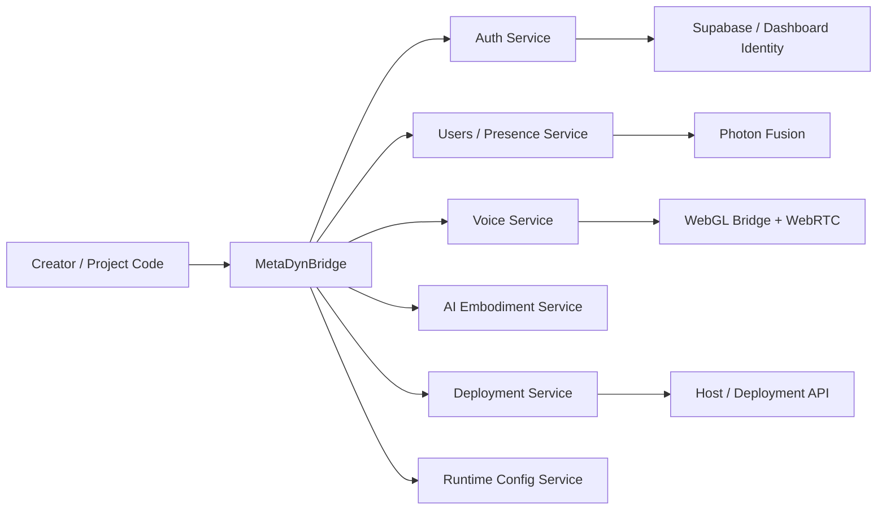
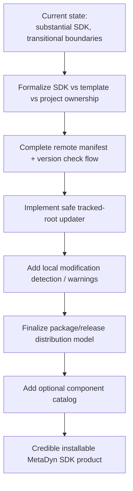

# Unity 6 SDK Productization

This document captures the current MetaDyn SDK boundary, packaging direction, update model, and productization gaps between the working Unity project and the installable platform MetaDyn intends to ship.

## Executive Summary

MetaDyn is not just building a Unity scene collection. It is building a reusable platform layer that should eventually be installable into other Unity projects.

The current documented product shape has three related parts:
- **MetaDyn SDK** — reusable runtime/editor/platform systems
- **MetaDyn Starter Space Template** — a MetaDyn-owned starter project or environment built on top of the SDK
- **MetaDyn Hosted Platform** — the deployment/runtime/backend layer that makes spaces operational on the web

The practical challenge is that the current codebase already contains much of this functionality, but the package boundaries are still transitional.

## What Productization Means Here

In MetaDyn, productization does not just mean “zip up some scripts.”
It means turning a powerful but historically evolved Unity platform into a repeatable creator product with:
- clear file ownership
- stable install/update expectations
- explicit dependency contracts
- in-editor visibility
- safe upgrade behavior
- a documented split between reusable systems and project content

A productized SDK should answer all of these questions cleanly:
- What belongs to MetaDyn and should travel between projects?
- What can be updated safely?
- What must stay under creator/project control?
- How does a creator understand update state from inside Unity?
- How do deployment, identity, and runtime bridges fit into the SDK contract?

## Current Product Boundary

### What Counts As SDK Today

The imported inventory docs define the current core SDK/update scope as:
- `Assets/MetaDyn/**`
- `Assets/Plugins/WebGL/**` for MetaDyn browser bridge files
- `Assets/StreamingAssets/microphone-processor.js`
- several baseline platform files that still live outside `Assets/MetaDyn`

### Important Transitional Reality

Some files are still structurally outside the future ideal SDK folder layout, but they are functionally part of the platform.

The most important documented examples are:
- `Assets/Common/UIGameMenu.cs`
- `Assets/Common/UIGameMenu.prefab`
- `Assets/Pavilion/Scripts/GameManager.cs`
- `Assets/Pavilion/Scripts/Player.cs`
- `Assets/Pavilion/Scripts/PlayerInput.cs`
- `Assets/Pavilion/Scripts/AvatarSdkPlayerLipSync.cs`
- `Assets/Pavilion/Scripts/Wolf3DPlayerLipSync.cs`

These should not be mentally dismissed as project glue just because of where they live today.

## Canonical Current SDK-Owned Paths

The imported manifest and PRD material repeatedly treat the following paths as canonical update/install targets:
- `Assets/MetaDyn`
- `Assets/Common`
- `Assets/Plugins/WebGL`
- `Assets/Pavilion/Scripts/GameManager.cs`
- `Assets/Pavilion/Scripts/Player.cs`
- `Assets/Pavilion/Scripts/PlayerInput.cs`
- `Assets/Pavilion/Scripts/AvatarSdkPlayerLipSync.cs`
- `Assets/Pavilion/Scripts/Wolf3DPlayerLipSync.cs`
- `Assets/Photon`
- `Assets/StreamingAssets/microphone-processor.js`

That is important for two reasons:
1. the updater should not invent a fantasy file layout that the working project does not use
2. product docs should reflect current operational reality, not only future cleanup goals

## SDK Product Surface Map

| Surface | What It Includes | Why It Is Part Of The SDK Product |
|---|---|---|
| Runtime systems | interaction, social, audio, AI, auth bootstrap, user list | These are the reusable platform capabilities creators rely on |
| Editor tooling | MetaDyn Dashboard, menu, project config, deployment manager | The SDK experience is intentionally Unity-native |
| Browser bridge layer | WebGL `.jslib` files, mic processor, auth bridge | WebGL is the primary delivery target, so browser interop is core product surface |
| Deployment tooling | deploy UX, config, version-aware tooling | Deployment is part of creator workflow, not separate ops garnish |
| Dependency contract | Photon Fusion compatibility and required versions | The SDK is incomplete without its networking substrate |
| Update system | local manifest, remote manifest plan, dashboard update state | Productization requires visible lifecycle management |

## Why Productization Matters

Without clear SDK boundaries, MetaDyn risks several problems:
- hard-to-maintain updates
- fuzzy distinction between reusable platform code and one-off world logic
- unsafe overwrite behavior during updates
- weak install story for external creators or partner teams
- confusion about what belongs in the SDK versus the starter template

Productization is what turns “we have a sophisticated project” into “we have a platform.”

## Open SDK And Connected Ecosystem Direction

A major product decision documented on 2026-05-25 sharpens the intended release model:
- the advanced SDK itself is intended to be released as an **open-source SDK**
- creators should be able to self-host and run their own build independently
- creators should also be able to host with MetaDyn or connect to the broader MetaDyn ecosystem for added value
- the connected ecosystem layer can carry membership-gated or service-gated benefits
- the platform should not strand creators if MetaDyn disappears; a creator should be able to disable MetaDyn authentication in Unity and keep running their own build

This is a strategically important clarification because it means productization is not only about packaging. It is also about preserving creator continuity, trust, and exit safety while still creating strong reasons to participate in the wider MetaDyn network.

## Current SDK Scope Categories

### 1. Runtime Systems
Examples from the imported docs:
- core reusable components such as `SeatHotspot`, `Interactable`, `ProjectionSurface`, `Trigger`, and `EntrancePoint`
- managers such as `InputManager`, `SettingsManager`, and `UIManager`
- auth/runtime bridges
- AI embodiment systems
- user list and social systems
- WebRTC and audio integration

### 2. Editor Tooling
Examples:
- `MetaDynDashboard`
- `MetaDynMenu`
- `MetaDynProjectConfig`
- `MetaDynDeploymentManager`
- `MetaDynServerProfile`

These are crucial because MetaDyn’s platform experience is intentionally Unity-native, not “download some files and fend for yourself.”

### 3. Browser / WebGL Bridge Layer
Examples:
- `AuthBridge.jslib`
- `MicrophonePlugin.jslib`
- `ProjectionSurface.jslib`
- `WebRTCVoice.jslib`
- `microphone-processor.js`

These are part of the SDK story because the primary target is WebGL.

## SDK Component Taxonomy

| Category | Example Files / Systems | Productization Implication |
|---|---|---|
| Core runtime components | `Interactable`, `SeatHotspot`, `ProjectionSurface`, `Trigger` | Should become clean reusable package content |
| Session/player bootstrap | `GameManager`, `Player`, `PlayerInput`, `UIGameMenu` | Transitional today, but effectively baseline SDK |
| Identity/auth bridge | `SupabaseAuthManager`, `WebAuthBridge`, `AuthBridge.jslib` | Platform-critical and tightly tied to hosted identity flow |
| Social/presence | user list, name tags, moderation-adjacent runtime | Core platform value, not optional garnish |
| Voice/media | WebRTC bridge, mic processor, lip sync adapters | Must remain visible as WebGL/runtime dependencies |
| Editor UX | dashboard, menus, config assets, deployment manager | Must feel like an integrated toolkit |
| Update machinery | manifest, version comparison, tracked roots | Needed for a credible install/update lifecycle |

## SDK Experience Goals

The imported docs already point toward a productized creator experience inside Unity.

Expected UX:
- open Unity
- see MetaDyn SDK status in the dashboard
- see installed version and latest version
- see supported Fusion version and installed version
- check for updates
- update safely when appropriate
- eventually browse/install optional components

This matters because MetaDyn is not just shipping runtime scripts. It is shipping a creator workflow.

## Creator Experience Flow

## Distribution Model Layers

| Layer | Purpose | Current State |
|---|---|---|
| Source of truth | GitHub/release/manifest-backed SDK source | Planned direction |
| Local project metadata | installed version + tracked roots | Present via local manifest direction |
| Unity editor UI | update visibility and actions | Mock UI exists, real fetch still pending |
| Update engine | replace tracked roots safely | Planned, not fully implemented |
| Optional component catalog | discover/install extra modules | Planned only |

## Update System Direction

### Current Status
Documented current state includes:
- a real local SDK manifest file exists
- the Unity dashboard already shows mock update UI
- Photon Fusion version visibility is already planned into the dashboard surface
- the real missing piece is remote manifest fetch and a safe update execution path

### Current Manifest Direction
The imported manifest planning includes fields for:
- SDK version
- channel (`stable`, later possibly `beta`)
- Unity version compatibility
- Photon Fusion compatibility
- download/release notes URLs
- tracked roots

That is the correct shape for a practical updater.

### Important Operational Principle
The update system must preserve project-specific content and avoid blindly overwriting user work.

That means update productization needs:
- tracked roots
- local-modification awareness
- compatible-version checks
- migration notes when needed
- a safe user-controlled flow rather than silent mutation

## Update Decision Table

| Situation | Expected Dashboard State | Expected Updater Behavior |
|---|---|---|
| Installed version matches latest | `Up to date` | Disable update button |
| New compatible version exists | `Update available` | Allow creator-controlled update |
| Remote manifest fetch fails | `Check failed` or equivalent | Do not mutate project |
| Fusion version incompatible | Warning / blocked state | Require correction before normal update |
| Local SDK files modified | Warning / review state | Avoid silent overwrite; require explicit review |
| Installed version below migration floor | Special migration warning | Do not treat as standard in-place update |

## Remote Manifest Contract

| Field | Purpose | Why It Matters |
|---|---|---|
| `latestVersion` | current SDK release | drives update decision |
| `minimumSupportedVersion` | minimum direct-update floor | protects against unsafe leap updates |
| `unity.minimumVersion` | baseline supported Unity version | avoids invalid editor combinations |
| `unity.recommendedVersion` | preferred editor version | gives creators a target environment |
| `fusion.supportedVersion` | expected networking dependency version | avoids subtle networking drift |
| `downloadUrl` | release artifact source | powers the update flow |
| `trackedRoots` | canonical replace/manage scope | defines what the updater owns |

## Photon Fusion As A Product Dependency

The older docs describe Photon Fusion as a required dependency of the MetaDyn SDK, but that is no longer the best description of the active Starter runtime baseline.

Current platform direction after the UGS migration sprint:
- the active Starter networking baseline is **UGS + Netcode for GameObjects (NGO)**
- the dashboard/product surface should prioritize visibility into installed UGS packages and Unity Services readiness
- Photon/Fusion may still appear in historical or reference-only contexts, but it should not be presented as the primary production requirement for the migrated branch

MetaDyn should now treat the networking dependency contract as:
- required UGS/NGO package visibility in install/update planning
- clear editor/dashboard surfacing for Unity Services readiness
- explicit differentiation between active baseline dependencies and legacy/reference context

### Fusion Visibility Table

| Fusion Concern | Product Requirement |
|---|---|
| Supported version | Show exact supported version in dashboard |
| Installed version | Detect and display local project version |
| Compatibility mismatch | Warn clearly before update/install actions |
| Distribution expectation | Treat as required dependency of a working SDK install |
| Licensing/scale nuance | Document separately when relevant, but keep compatibility visible in Unity |

## The MetaDyn Bridge / Service Direction

The imported SDK docs point at an architectural improvement that would make productization stronger: a clearer central bridge/service model rather than direct singleton discovery everywhere.

Suggested future direction includes:
- a central `MetaDynBridge` or equivalent entry point
- explicit subsystem interfaces for auth, users, AI, voice, deployment, and runtime config
- cleaner separation between stable SDK-facing contracts and project-level implementation details

This is not yet the full current implementation, but it is a useful north star for documentation and refactoring decisions.

### Service-Oriented SDK Target

This target matters because a productized SDK should expose a stable conceptual API even while underlying implementation details evolve.

## Starter Template vs SDK

The documentation should keep this distinction sharp.

### MetaDyn SDK
Reusable systems that should travel across projects.

### MetaDyn Starter Space Template
A MetaDyn-owned starter environment built using the SDK, including baseline world setup and content scaffolding.

### Project-Specific Content
Environment-specific assets, scene polish, and world-specific glue that should not be treated as part of the reusable SDK by default.

This distinction is one of the main things that prevents future update pain.

## Deliverable Boundary Matrix

| Deliverable | Includes | Excludes |
|---|---|---|
| MetaDyn SDK | reusable runtime/editor/platform systems, browser bridges, deployment tooling, dependency contract | project-specific environment art, bespoke scenes, client-specific content |
| Starter Space Template | SDK + starter environment + baseline setup | unrelated customer/world-specific customization |
| Project Content | scene-specific polish, custom world logic, activation-specific assets | reusable MetaDyn platform systems unless explicitly extended |

## Deployment Tooling Belongs In The SDK

One of the most important product decisions in the imported docs is that deployment tooling is not separate ops garnish. It is part of the SDK.

That means:
- creators should be able to reason about deployment from inside Unity
- deployment/version/config surfaces belong in the MetaDyn dashboard/menu story
- the SDK is partly a runtime package and partly a creator operations surface

That is a stronger and more ambitious product stance than a conventional “asset pack.”

## SDK Ownership And Update Safety

A productized SDK needs clear answers on who owns what.

| Asset / Area | Default Owner | Update Safety Expectation |
|---|---|---|
| SDK runtime/editor files | MetaDyn | Updater may manage when tracked |
| Browser bridge files | MetaDyn | Updater may manage when tracked |
| Template baseline files | Shared / transitional | Needs careful review during updates |
| Scenes and environment content | Creator / project | Must not be silently overwritten |
| Avatar assets and bespoke content | Creator / project | Outside normal SDK replacement scope |
| ProjectSettings | Project / template-specific | Not part of SDK by default |

## Current Packaging Gaps

The imported docs are already honest about the current gaps.

Most important ones:
1. SDK packaging/distribution is not fully productized yet
2. remote manifest fetch is not yet implemented
3. file boundaries still reflect transitional project history
4. update/install safety mechanisms need more detail
5. optional component/catalog install flow is still planned, not realized
6. the final package/install story for external use is still being formed

## Productization Roadmap Shape

## Documentation Guidance

The docs should present the SDK as:
- **real and already substantial**
- **not yet fully packaged or distributed in final form**
- **clearly separated in concept even when some files are still transitional in placement**

That is more accurate than either “it is already a finished package product” or “it is just a Unity project with some helpers.”

## Recommended Structure For The Curated Docs

The normalized docs should keep pointing readers to four distinct concerns:
1. what the SDK is
2. what files currently belong to it
3. how deployment and hosting tie into it
4. what remains to be productized before it is a clean install/update product

## Key Open Questions

1. Which out-of-folder baseline files should be moved into cleaner SDK/package boundaries first?
2. What update behavior is allowed when creators have modified SDK-owned files locally?
3. What is the final distribution mechanism: GitHub releases, package feed, OpenUPM-compatible path, or a hybrid?
4. Which systems are baseline SDK versus optional installable modules?
5. What is the exact division between SDK and starter-space template over time?

## Recommended Next Moves

| Priority | Move | Why |
|---|---|---|
| High | Finish remote manifest fetch in `MetaDynDashboard` | Makes update UX real instead of conceptual |
| High | Formalize tracked-root ownership contract | Prevents destructive or fuzzy updates |
| High | Document local modification handling rules | Protects creator trust |
| Medium | Clarify package-friendly folder targets | Reduces long-term packaging friction |
| Medium | Define optional modules vs baseline SDK | Enables cleaner product tiers |
| Medium | Harden dependency validation around Fusion | Avoids install drift |

## Source Basis

Primary imported sources used in this synthesis:
- `import/unity6-docs/.claude/Quick Reference/SDK_DEVELOPMENT.md`
- `import/unity6-docs/.claude/Quick Reference/SDK_TOOLKIT_INVENTORY.md`
- `import/unity6-docs/.claude/Quick Reference/SDK_UPDATE_MANIFEST.md`
- `import/unity6-docs/.claude/Planning/MetaDyn_Platform_PRD_v1.0.md`
- `import/unity6-docs/.claude/Planning/Dashboard_Unity_Hyperfy_Flows.md`
