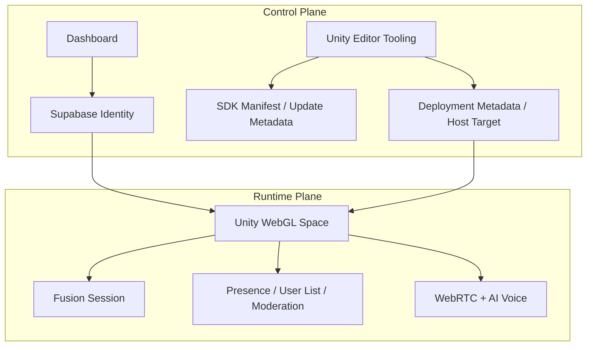
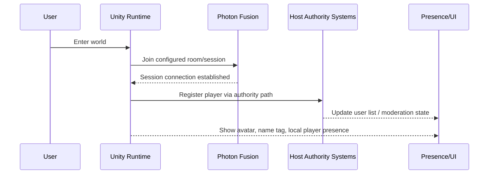

# System Architecture

## Technical Baseline

Documented platform baseline from the imported material:
- Unity 6 (`6000.0.62f1`)
- URP 17.0.4
- Photon Fusion 2.0.9 Stable
- Shared Mode networking
- WebGL as primary target
- Native builds as secondary target
- Supabase for authentication/profile systems
- Cloudflare for DNS, SSL, proxying, and edge delivery
- WebRTC for player-to-player voice

## Executive Framing

MetaDyn’s Unity architecture is best understood as a **platform stack**, not a single game-style application.

The current system combines:
- a reusable SDK/platform layer
- a dashboard-led identity/control model
- a WebGL-first immersive runtime
- a realtime social stack
- a voice/media layer
- an environment-specific hosting and routing layer

That means the architecture has to serve two goals at once:
1. power a live immersive space at runtime
2. remain reusable across many spaces, deployments, and customers

## Layered Platform Model

The platform is built as a layered architecture.

### Experience Layer
Unity scenes, player interactions, social spaces, avatars, UI, and immersive world logic.

### Platform Layer
MetaDyn-owned runtime/editor/deployment systems that provide the reusable platform capabilities inside projects.

### Identity Layer
Supabase-backed authentication, profile loading, avatar persistence, cookie/session continuity, and Unity-side authorization boundaries.

A newly documented security priority is that authorization decisions inside Unity must not trust client-supplied identity fields as proof of identity. Owner/admin behavior should ultimately come from validated session state or signed backend claims rather than raw UUID comparison.

### Realtime Social Layer
Photon Fusion sessions, spawning, user list synchronization, permissions/moderation, and presence handling.

### Voice Layer
Two distinct communication paths are documented:
- AI push-to-talk voice flow
- player-to-player WebRTC voice flow

For the platform section, the most important part is that real-time player communication is a first-class system and WebGL-compatible.

### Hosting Layer
Cloudflare + origin hosting + per-space isolated deployment directories, with a trajectory toward shared-hosted and self-hosted delivery.

## Architecture Responsibility Matrix

| Layer | Primary Responsibility | Core Systems | Current Maturity |
|---|---|---|---|
| Experience | what the player sees and does | scenes, avatars, UI, interactions, environment logic | active and real |
| SDK / Platform | reusable MetaDyn capabilities | `Assets/MetaDyn`, baseline bootstrap/runtime files, editor tooling | substantial but transitional in boundaries |
| Identity | who the user is | dashboard login, shared cookie, Supabase, profile fetch, avatar persistence | implemented for Unity |
| Realtime Social | who is present together | Fusion sessions, spawn/join, user list, moderation | implemented |
| Voice / Media | how users and AI speak | WebRTC, mic worklet, AI push-to-talk path, lip sync | implemented with future scaling work |
| Hosting / Delivery | where spaces run | Cloudflare, nginx/origin hosts, per-space deploys, routing | real but still maturing operationally |
| Control Plane | how creators operate the platform | dashboard, deployment UX, SDK update direction, metadata | partly implemented, partly planned |

## Control Plane vs Runtime Plane

A clean way to reason about MetaDyn is to separate **control plane** functions from **runtime plane** functions.

### Control Plane
Includes:
- dashboard login and profile management
- Unity editor dashboard and deployment tooling
- release/update metadata for the SDK
- deployment target profiles and runtime config
- host/routing decisions
- future governance and deployment visibility

### Runtime Plane
Includes:
- live Unity WebGL build
- player spawning and avatar continuity
- Fusion room/session state
- user list, moderation, and presence
- WebRTC voice and AI interactions

### Why This Matters
The runtime plane delivers the experience.
The control plane makes that experience repeatable, governable, and scalable across many spaces.

## Runtime System Composition

At runtime, a MetaDyn space is not just “the scene.” It is the combination of:
- scene/environment content
- player/session bootstrap systems
- identity bootstrap
- social synchronization
- voice/media systems
- runtime configuration

### Runtime Composition Table

| Runtime Concern | Main Components | Notes |
|---|---|---|
| Space bootstrap | `UIGameMenu`, `GameManager`, runtime config | handles entry and session setup |
| Player embodiment | `Player`, avatar systems, name tags | applies identity and social presence |
| Identity bootstrap | `WebAuthBridge`, `SupabaseAuthManager`, `AuthBridge.jslib` | validates current user context |
| Session authority | Fusion Shared Mode + host-owned central systems | hybrid authority model |
| Social systems | user list, moderation, join/leave handling | host-controlled shared state |
| Voice systems | WebRTC voice + AI push-to-talk systems | separate media paths with different purposes |
| Browser interop | `.jslib` bridges and audio worklet assets | required because WebGL is primary |

## Networking Model

### Photon Fusion Shared Mode
The platform intentionally uses Photon Fusion Shared Mode rather than a dedicated client-server authority model.

Reasons documented in imported decisions:
- social/metaverse use case over competitive gameplay
- easier iteration and development speed
- natural player authority over their own objects
- host authority retained for selected global systems such as moderation/user management

### Hybrid Authority Pattern
The platform uses a hybrid authority design:
- players control their own player objects
- host/state authority controls central systems like the user list and moderation actions
- registration into host-controlled systems occurs via RPC patterns

### Authority Breakdown Table

| System | Typical Authority | Why |
|---|---|---|
| Player movement / avatar object | player-owned | natural local control |
| Global user list | host / state authority | shared source of truth |
| Kick / ban / moderation | host / admin authority | requires centralized enforcement |
| Join registration | RPC into authority-owned system | keeps state coherent |
| Display/profile continuity | validated identity + profile load | should not trust arbitrary local values |

## Social Presence Architecture

The social layer is more than transport. It turns users into visible participants in a shared world.

Key responsibilities:
- joining the correct session
- representing player identity in-world
- showing name/user presence
- tracking who is currently in-session
- enabling moderation actions
- linking social state with voice state and profile continuity

### Social Stack Flow

## Voice / Media Architecture

MetaDyn currently has two parallel voice paths because they solve different problems.

### 1. Player-to-Player Voice
Used for live social presence inside the space.

Core path:
- browser-native WebRTC audio
- Fusion signaling / coordination
- avatar lip sync and spatial audio behavior

### 2. AI Push-to-Talk Voice
Used for interacting with embodied AI systems.

Core path:
- browser microphone capture / worklet
- audio recording pipeline
- speech-to-text
- model inference / orchestration
- TTS playback + animation/lip sync hooks

### Voice Path Comparison

| Voice Path | Main Purpose | Core Tech | Scaling Constraint |
|---|---|---|---|
| WebRTC player voice | social communication | WebRTC P2P mesh | larger rooms eventually need SFU |
| AI voice | user-to-agent conversation | mic capture, STT, model calls, TTS | driven more by inference/media pipeline than room topology |

## Identity As An Architectural Layer

Identity is not a bolt-on login system.
It is one of the architectural layers that ties the platform together.

What it currently provides:
- canonical user UUID
- dashboard-led authentication
- profile fetch and avatar continuity
- session bootstrap into Unity spaces
- a bridge point for continuity across surfaces

What it should eventually provide more strongly:
- trusted claims for authorization-sensitive behavior
- cross-runtime profile continuity between Unity and Hyperfy
- a cleaner distinction between identity proof, display data, and local presentation state

## Space Deployment Model

A central architectural rule appears repeatedly in the imported docs:

**Each space is its own build.**

That rule remains true whether the space is:
- self-hosted
- MetaDyn shared-hosted
- deployed under a subdomain or routed hostname

This is one of the most important architecture rules because it preserves:
- deployment isolation
- rollback clarity
- per-space runtime config
- flexibility for branded/client spaces

## Space Architecture Pattern

| Space Concern | Per-Space | Shared Across Platform |
|---|---|---|
| Build output | Yes | No |
| Scene/environment content | Yes | No |
| Runtime config | Yes | partly standardized |
| SDK platform layer | No | Yes |
| Auth/profile model | No | Yes |
| Creator workflow | No | Yes |
| Deployment philosophy | No | Yes |

## Transitional Boundary Reality

A key conclusion from the deeper import review is that MetaDyn is already thinking like a **multi-space platform**, but the implementation boundary between project code and platform code is still transitional.

In practice, the current platform spans both:
- `Assets/MetaDyn/**`
- several still-essential files outside that root, such as shared/common and Pavilion runtime files

That means the platform architecture is real, but the packaging boundary is not fully clean yet.

## Current File-Boundary Implication

| Boundary Question | Current Answer |
|---|---|
| Is the SDK real? | Yes |
| Is every baseline platform file already in ideal package placement? | No |
| Does that reduce the architectural importance of those files? | No |
| Should docs reflect the current working file ownership map? | Yes |

## Hosting Layer As Architecture, Not Ops Afterthought

The hosting layer is part of the architecture because the space model depends on:
- per-space build deployment
- shared vs self-hosted routing patterns
- Cloudflare edge behavior
- nginx/origin mapping
- deployment metadata and directory isolation

This is why deployment and hosting belong in the architecture docs rather than being treated as a separate admin appendix.

## Productization Gaps Visible From Architecture

The imported docs also make it clear that some platform-level architecture is more mature in concept than in final productized form.

Examples include:
- SDK extraction and packaging boundaries
- dashboard-versus-Unity source-of-truth rules
- rollback/versioned deployment model
- shared-hosting provisioning automation
- unified cross-runtime identity flows beyond current Unity-first implementation

## Architecture Risks / Tensions

| Tension | Why It Exists | Recommended Framing |
|---|---|---|
| Platform reuse vs project history | current code evolved inside a working Unity project | document real boundaries while cleaning them over time |
| Fast WebGL delivery vs media scale | WebRTC mesh is excellent until room size grows | keep current design, document SFU path for larger scale |
| Identity continuity vs trust boundaries | continuity is working, authorization hardening still matters | separate authentication success from authorization trust |
| Multi-space ambition vs operational maturity | platform supports many spaces, ops automation is still maturing | describe as real but transitional |

## Recommended Reading After This

1. `platform-overview.md`
2. `auth-identity.md`
3. `deployment-hosting.md`
4. `sdk-productization.md`

## Source Basis

Primary imported sources reflected here:
- `import/unity6-docs/.claude/Planning/MetaDyn_Platform_PRD_v1.0.md`
- `import/unity6-docs/.claude/Quick Reference/INFRASTRUCTURE.md`
- `import/unity6-docs/.claude/Quick Reference/AUTH_SYSTEM.md`
- `import/unity6-docs/.claude/Quick Reference/SDK_TOOLKIT_INVENTORY.md`
- `import/unity6-docs/.claude/Quick Reference/QUICK_REFERENCE.md`
