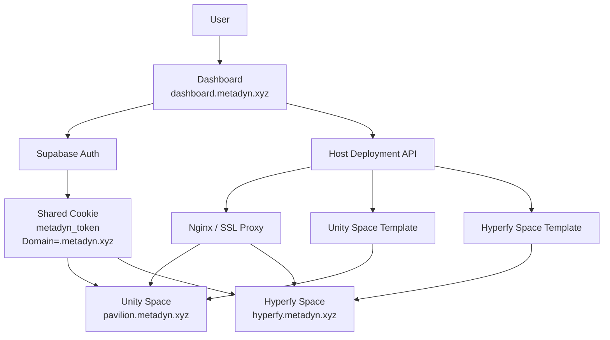
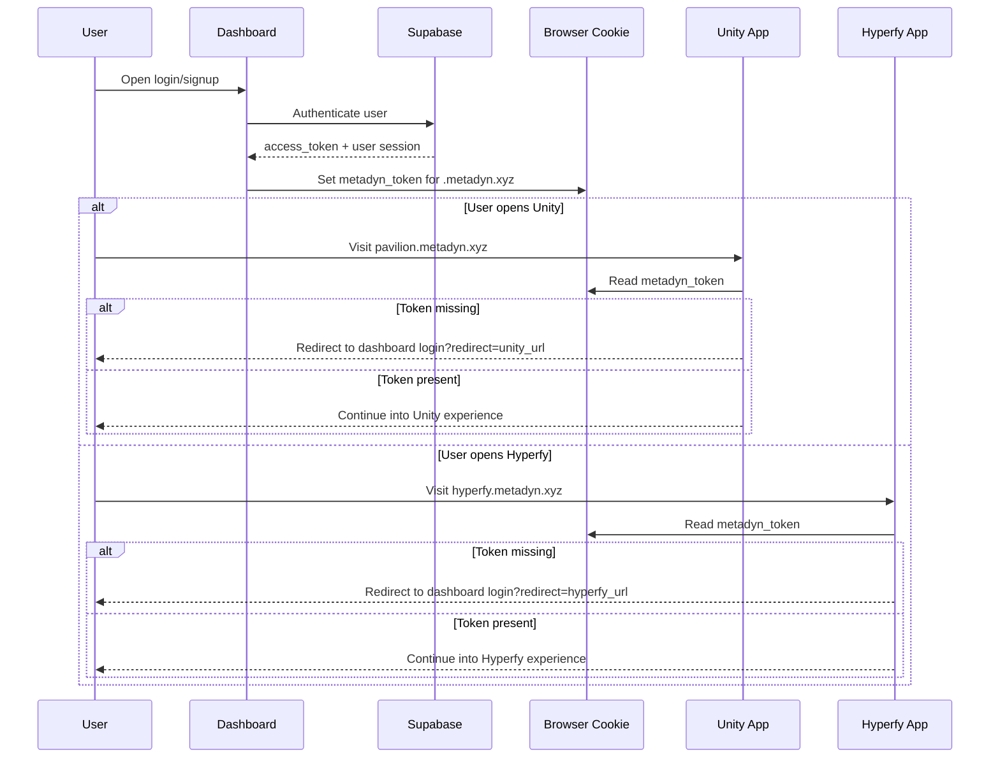
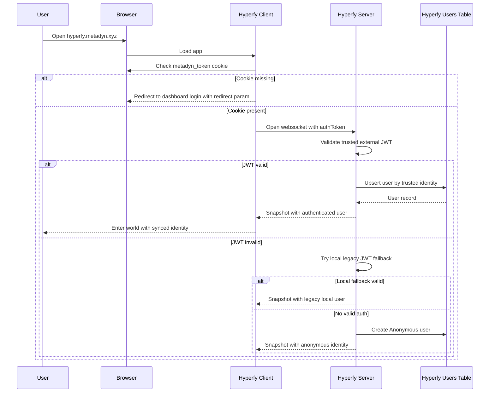
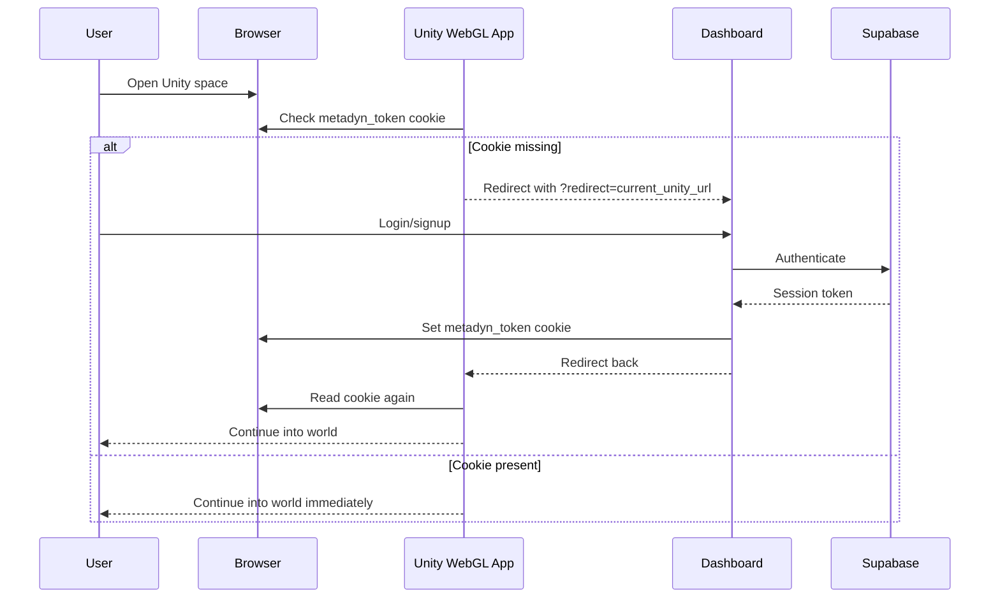
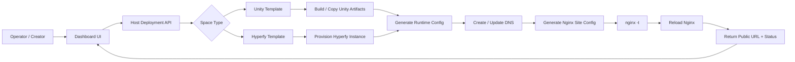
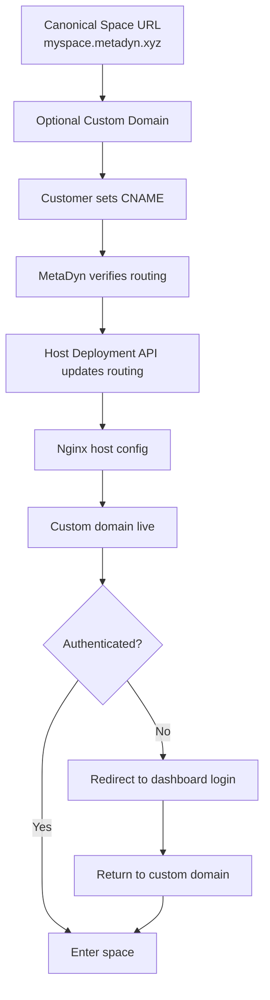

# Dashboard, Unity, and Hyperfy Flow Diagrams

## Unified Platform Flow

## Authentication Flow

## Hyperfy Login and Identity Flow

## Unity Login Flow

## Deployment and Provisioning Flow

## Custom Domain Extension Flow

## Notes

- The dashboard is the control plane.
- Unity and Hyperfy are consumer apps under the shared MetaDyn domain model.
- The host deployment API is the execution plane for provisioning and routing.
- Shared-cookie SSO works naturally under `*.metadyn.xyz`.
- Custom domains require a separate auth handoff strategy because they cannot read `.metadyn.xyz` cookies directly.
